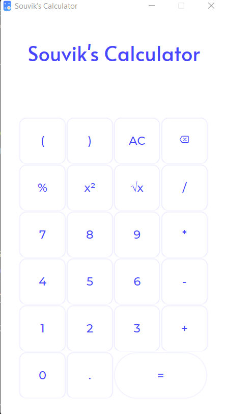

# Souvik's Calculator

This is a simple calculator created by **Souvik Roy**, which can run in a
windows machine and x64-based processor. 
This software is totally free and has a **MIT** license. 

***

## User Interface

 

> This is how the UI looks when you open it for the first time.